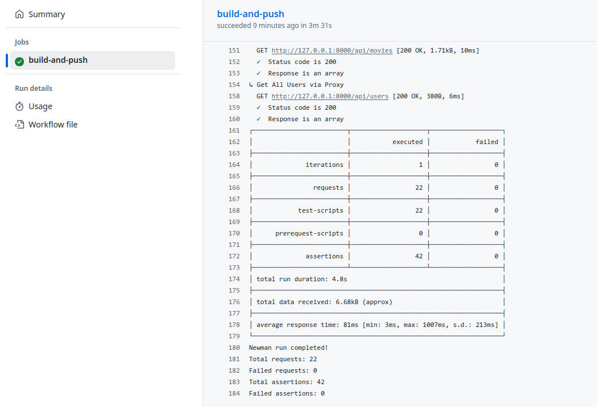
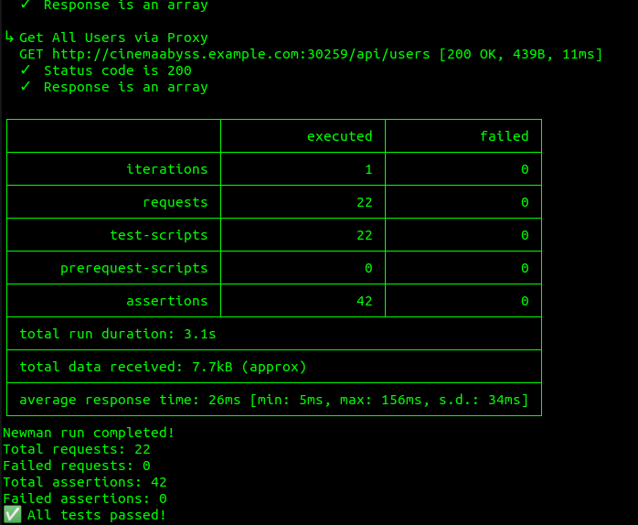
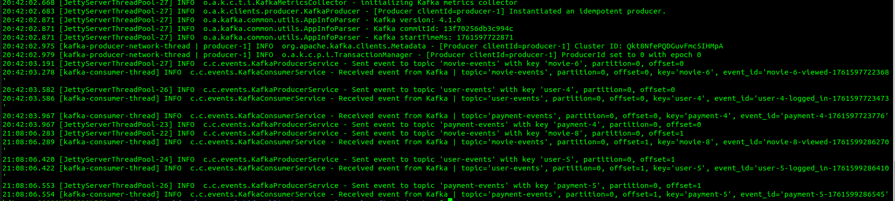
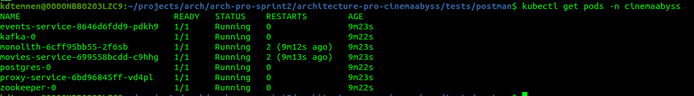
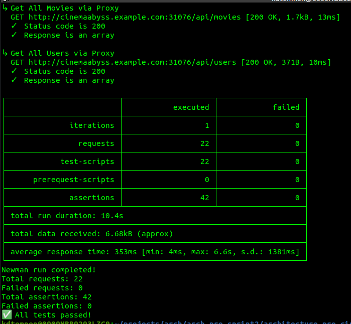
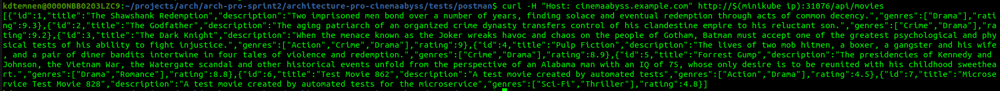

## Изучите [README.md](README.md) файл и структуру проекта.

## Задание 1

1. Спроектируйте to be архитектуру КиноБездны, разделив всю систему на отдельные домены и организовав интеграционное взаимодействие и единую точку вызова сервисов.
Результат представьте в виде контейнерной диаграммы в нотации С4.


[Исходный код диаграммы в формате PlantUML](docs/diagrams/C2_Container_ToBe.puml)

## Задание 2

### Решение Задания 2

Для выполнения задания были реализованы два микросервиса: `proxy-service` и `events-service`.

#### Часть 1. Реализация `proxy-service`

Прокси-сервис реализован на **Java 21** с использованием легковесного фреймворка **Spark Framework**. Такой выбор обусловлен простотой задачи (в основном, HTTP-роутинг) и желанием избежать избыточных зависимостей.

**Ключевые особенности реализации:**

1.  **Паттерн Strangler Fig:** Сервис реализует логику постепенной миграции трафика. Запросы, адресованные `/api/movies/**`, с вероятностью, заданной переменной окружения `MOVIES_MIGRATION_PERCENT`, перенаправляются на новый `movies-service`. Остальные запросы (включая `/api/movies/**` вне процента миграции и все другие пути) проксируются на легаси-монолит.
2.  **Полное проксирование:** Прокси корректно обрабатывает все HTTP-методы (`GET`, `POST`, `PUT`, `DELETE` и т.д.), а также пробрасывает тело запроса и все значимые HTTP-заголовки, обеспечивая прозрачность для клиентов.
3.  **Современный HTTP-клиент:** Для исходящих запросов используется встроенный в JDK `java.net.http.HttpClient`, работающий по протоколу HTTP/1.1.
4.  **Надежность и наблюдаемость:** Реализовано структурированное логирование с помощью SLF4J и Logback, а также глобальная обработка исключений для возврата ошибок в формате `application/problem+json`.

#### Часть 2. Реализация `events-service`

MVP-сервис для работы с Kafka реализован на **Kotlin** с использованием фреймворка **Javalin**. Этот стек был выбран для демонстрации современного, лаконичного и типобезопасного подхода к разработке.

**Ключевые особенности реализации:**

1.  **Паттерн Event Gateway:** Сервис предоставляет простое REST API (`POST /api/events/{user|movie|payment}`) для приема событий от других частей системы. Это инкапсулирует логику работы с Kafka в одном месте, упрощая другие сервисы.
2.  **Producer и Consumer:** Сервис содержит и Kafka Producer для отправки полученных событий в соответствующие топики (`user-events`, `movie-events`, `payment-events`), и Kafka Consumer, который подписывается на эти же топики.
3.  **Идемпотентность Consumer'а:** Для выполнения требования "сам же читать сообщения" и демонстрации надежной обработки, консьюмер реализован идемпотентным. При получении события он проверяет `eventId` в **PostgreSQL**, чтобы избежать повторной обработки дубликатов. Это отвечает на вопрос о необходимости `postgres` в зависимостях сервиса.
4.  **Надежность Producer'а:** Kafka Producer сконфигурирован с опциями `acks=all` и `enable.idempotence=true` для обеспечения надежной доставки сообщений.
5.  **Graceful Shutdown:** Реализован механизм корректной остановки, который при завершении работы закрывает консьюмера, продюсера и пул соединений к БД.

#### Особенности запуска и тестирования

Для обеспечения надежного и воспроизводимого запуска всего окружения (включая машину ревьюера) были решены следующие инженерные задачи:

1.  **Проблема гонки состояний при запуске:** Поскольку `docker-compose` версии `3.3` (для совместимости со старыми ОС, например, Ubuntu 20.04) не поддерживает ожидание `healthcheck`, была внедрена утилита **`wait-for-it.sh`**. Она гарантирует, что `proxy-service` и `events-service` стартуют только после полной готовности их зависимостей (monolith, kafka, postgres и т.д.).
2.  **Проблема с именованием сети:** Чтобы избежать зависимости от имени директории проекта, был создан единый скрипт-оркестратор **`start-and-test.sh`**. Он принудительно задает имя проекта `cinemaabyss` через флаг `-p` для `docker-compose` и автоматически подставляет правильное имя сети в скрипт запуска тестов, обеспечивая 100% воспроизводимость.

Для production-окружения в CMD Docker-файла рекомендуется явно задавать максимальный размер heap (Xmx), например, в 75-80% от лимита памяти контейнера, для более предсказуемого управления ресурсами JVM

Все тесты из коллекции Postman успешно пройдены.

### Скриншоты

**Результаты Postman-тестов:**


**Состояние топиков в Kafka UI:**

*   Обзор топика `movie-events`:
    
*   Сообщение в топике `movie-events`:
    
*   Обзор топика `user-events`:
    
*   Сообщение в топике `user-events`:
    
*   Обзор топика `payment-events`:
    
*   Сообщение в топике `payment-events`:
    

### Решение Задания 3

Задание было разделено на две части: настройка CI/CD и развертывание сервисов в Kubernetes.

#### Часть 1. Настройка CI/CD

Для автоматизации сборки, тестирования и публикации Docker-образов был доработан workflow в файле `.github/workflows/docker-build-push.yml`. В результате был создан полноценный CI-пайплайн, следующий лучшим практикам "Test before Push".

**Ключевые этапы реализованного workflow:**

1.  **Сборка образов:** На первом этапе пайплайн собирает Docker-образы для всех четырех сервисов (`monolith`, `movies-service`, `proxy-service`, `events-service`), используя `docker/build-push-action` с опциями `push: false` и `load: true`. Это позволяет подготовить образы для тестирования, не публикуя их в registry.

2.  **Запуск тестового окружения:** С помощью `docker-compose` поднимается полная инфраструктура проекта, включая все сервисы, Kafka и PostgreSQL.

3.  **Интеграционное тестирование:** После того как все сервисы запущены и готовы к работе (реализован механизм "умного" ожидания доступности портов), запускаются Postman API-тесты (`npm run test:local`). Если хотя бы один тест проваливается, весь workflow останавливается с ошибкой.

4.  **Публикация образов:** Только в случае успешного прохождения всех тестов запускается финальный шаг, который публикует (`docker push`) ранее собранные образы в GitHub Container Registry (`ghcr.io`). Публикация настроена только для ключевых веток (`main`, `cinema`), чтобы не засорять registry артефактами из feature-веток.

В процессе настройки были решены следующие технические задачи:
*   **Проблема `lowercase`:** Имена образов в `ghcr.io` должны быть в нижнем регистре. Эта проблема была решена путем динамической генерации `lowercase` имени репозитория на лету внутри workflow.
*   **Права доступа `GITHUB_TOKEN`:** Были корректно настроены `permissions` на уровне репозитория и workflow (`packages: write`) для предоставления CI-пайплайну прав на публикацию пакетов.
*   **Гонка состояний при запуске тестов:** Проблема `Connection Refused` при запуске тестов была решена путем добавления в `docker-compose.yml` утилиты `wait-for-it.sh` для всех сервисов, что гарантирует их корректный порядок запуска и готовность перед началом тестов.

Успешное выполнение этого workflow подтверждает, что все сервисы корректно собираются, интегрируются друг с другом и проходят полный набор API-тестов.

**Приложенные артефакты:**

*   **Успешное выполнение workflow**
    

#### Часть 2. Настройка прокси-сервиса в Kubernetes

Для развертывания системы в Kubernetes был выполнен полный цикл работ, включая решение ряда нетривиальных проблем с локальным окружением.

**Шаг 1: Подготовка учетных данных и конфигураций**

1.  Был создан **Personal Access Token (PAT)** в GitHub с правами `read:packages` и `write:packages` для доступа к GitHub Container Registry (ghcr.io).
2.  С помощью `docker login` и `kubectl create secret` был подготовлен манифест `dockerconfigsecret.yaml`, содержащий учетные данные для Kubernetes.
3.  Были исправлены пути к Docker-образам во всех манифестах развертывания (`monolith.yaml`, `movies-service.yaml`, `proxy-service.yaml`, `events-service.yaml`), чтобы они указывали на репозиторий `ghcr.io/manjago/architecture-pro-cinemaabyss/...`. **Была обнаружена и исправлена проблема с регистром имени пользователя**, так как Docker CLI требует `lowercase`.

**Шаг 2: Создание манифестов для `proxy-service` и `events-service`**

На основе предоставленных примеров были созданы файлы `proxy-service.yaml` и `events-service.yaml`, каждый из которых содержит ресурсы `Deployment` и `Service`. В процессе были решены следующие задачи:
*   **Корректная конфигурация `env`:** Для `events-service` были добавлены все необходимые переменные окружения для подключения к Kafka и PostgreSQL.
*   **Настройка Health Checks:** Для обоих сервисов были настроены `livenessProbe` и `readinessProbe`, указывающие на реальные `healthcheck`-эндпоинты (`/health` и `/api/events/health`), что предотвратило циклические перезапуски подов (`CrashLoopBackOff`).
*   **Проброс статусов и заголовков:** Код `proxy-service` был доработан для корректного проксирования не только тела ответа, но и **HTTP-статуса и заголовков**, что позволило тестам на создание сущностей (ожидающим статус `201 Created`) проходить успешно.

**Шаг 3: Развертывание в Minikube**

В процессе развертывания была решена **проблема с запуском `ingress-addon`** в условиях корпоративной сети. Решение включало предварительное скачивание необходимых Docker-образов и их загрузку в Minikube с помощью `minikube image load`.

После решения проблем с окружением, вся инфраструктура (Postgres, Kafka, Zookeeper) и все приложения (monolith, movies, events, proxy) были успешно развернуты в `namespace cinemaabyss`.

**Шаг 4: Тестирование**

Для проведения тестов была решена **проблема сетевой связности** между тестовым контейнером Newman и кластером Minikube, работающим в режиме `NodePort`. Был создан специальный скрипт `run-k8s-tests.sh`, который:
1.  Автоматически определяет IP-адрес Minikube (`minikube ip`).
2.  Запускает тестовый контейнер с флагом `--add-host`, "пробрасывая" домен `cinemaabyss.example.com` на IP-адрес Minikube.
3.  Подключает тестовый контейнер к сети `minikube` для гарантированной связности.

Все тесты из коллекции Postman для Kubernetes-окружения **успешно пройдены**.

**Приложенные артефакты:**

*   **Результаты выполнения тестов:**
    

*   **Логи `event-service`, подтверждающие обработку событий:**
     


### Решение Задания 4

Для упрощения развертывания и управления приложением в Kubernetes был реализован Helm-чарт, который пакетирует все необходимые манифесты и конфигурации.

**Проделанная работа:**

1.  **Параметризация `values.yaml`:**
    *   Все пути к образам в GitHub Container Registry (`ghcr.io`) были вынесены в `values.yaml` и исправлены для использования `lowercase` имени владельца (`manjago`), что является требованием Docker CLI.
    *   В секцию `imagePullSecrets` был добавлен base64-encoded `dockerconfigjson` для аутентификации в `ghcr.io`. В процессе отладки была решена проблема `illegal base64 data`, которая требовала добавления `padding` символов (`==`) в конец base64-строки для совместимости с Helm-парсером.

2.  **Шаблонизация манифестов:**
    *   Были созданы шаблоны для `proxy-service` и `events-service` в директории `templates/services/`.
    *   Все "статичные" значения (количество реплик, имена и теги образов, порты, лимиты ресурсов) были заменены на переменные Helm (`{{ .Values... }}`).
    *   Для `events-service` была корректно реализована передача переменных окружения для подключения к Kafka и PostgreSQL, значения для которых берутся как из `values.yaml`, так и из `Secret`'ов.
    *   Были добавлены стандартные Helm-метки (`app.kubernetes.io/name`, `app.kubernetes.io/instance`) для улучшения управляемости релиза.

3.  **Установка и проверка:**
    *   После очистки кластера (`kubectl delete namespace cinemaabyss`) приложение было успешно развернуто одной командой: `helm install cinemaabyss ./src/kubernetes/helm --namespace cinemaabyss --create-namespace`.
    *   В процессе отладки была обнаружена и исправлена опечатка в `ConfigMap` шаблоне (`movies` вместо `movies-service`), которая приводила к ошибкам `500 Internal Server Error`.
    *   **Заметка по доступу к кластеру:** В моем окружении `minikube` развернул `ingress-controller` с `Service` типа `NodePort`, а не `LoadBalancer`. В связи с этим, вместо использования `minikube tunnel`, для доступа к сервису был использован более прямой и надежный в данных условиях метод: обращение через IP-адрес `minikube` и динамический `NodePort`.
    *   Для финального тестирования был использован подход с `NodePort` для Ingress Controller'а и кастомный скрипт `run-k8s-tests.sh`, что подтвердило полную работоспособность развернутого через Helm приложения.

В результате был создан полноценный, переиспользуемый Helm-чарт, позволяющий разворачивать, конфигурировать и обновлять приложение "Кинобездна" централизованно и предсказуемо.

**Приложенные артефакты:**

*   **Скриншот развертывания Helm:**
    

*   **Результаты выполнения тестов для Helm-релиза:**
    

*   **Пример вызова API после установки Helm-чарта:**
    

# Задание 5
Компания планирует активно развиваться и для повышения надежности, безопасности, реализации сетевых паттернов типа Circuit Breaker и канареечного деплоя вам как архитектору необходимо развернуть istio и настроить circuit breaker для monolith и movies сервисов.

```bash

helm repo add istio https://istio-release.storage.googleapis.com/charts
helm repo update

helm install istio-base istio/base -n istio-system --set defaultRevision=default --create-namespace
helm install istio-ingressgateway istio/gateway -n istio-system
helm install istiod istio/istiod -n istio-system --wait

helm install cinemaabyss .\src\kubernetes\helm --namespace cinemaabyss --create-namespace

kubectl label namespace cinemaabyss istio-injection=enabled --overwrite

kubectl get namespace -L istio-injection

kubectl apply -f .\src\kubernetes\circuit-breaker-config.yaml -n cinemaabyss

```

Тестирование

# fortio
```bash
kubectl apply -f https://raw.githubusercontent.com/istio/istio/release-1.25/samples/httpbin/sample-client/fortio-deploy.yaml -n cinemaabyss
```

# Get the fortio pod name
```bash
FORTIO_POD=$(kubectl get pod -n cinemaabyss | grep fortio | awk '{print $1}')

kubectl exec -n cinemaabyss $FORTIO_POD -c fortio -- fortio load -c 50 -qps 0 -n 500 -loglevel Warning http://movies-service:8081/api/movies
```
Например,

```bash
kubectl exec -n cinemaabyss fortio-deploy-b6757cbbb-7c9qg  -c fortio -- fortio load -c 50 -qps 0 -n 500 -loglevel Warning http://movies-service:8081/api/movies
```

Вывод будет типа такого

```bash
IP addresses distribution:
10.106.113.46:8081: 421
Code 200 : 79 (15.8 %)
Code 500 : 22 (4.4 %)
Code 503 : 399 (79.8 %)
```
Можно еще проверить статистику

```bash
kubectl exec -n cinemaabyss fortio-deploy-b6757cbbb-7c9qg -c istio-proxy -- pilot-agent request GET stats | grep movies-service | grep pending
```

И там смотрим 

```bash
cluster.outbound|8081||movies-service.cinemaabyss.svc.cluster.local;.upstream_rq_pending_total: 311 - столько раз срабатывал circuit breaker
You can see 21 for the upstream_rq_pending_overflow value which means 21 calls so far have been flagged for circuit breaking.
```

Приложите скриншот работы circuit breaker'а

Удаляем все
```bash
istioctl uninstall --purge
kubectl delete namespace istio-system
kubectl delete all --all -n cinemaabyss
kubectl delete namespace cinemaabyss
```
